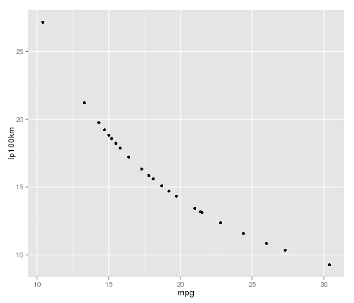
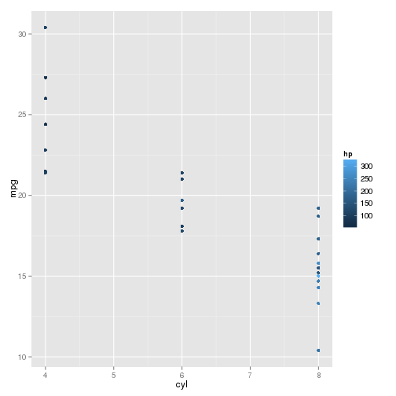

Example Data Processing Report
========================================================

This is an R Markdown document built on `2013-02-17 20:02:17`. Markdown is a simple formatting syntax for authoring web pages (click the **MD** toolbar button for help on Markdown).

When you click the **Knit HTML** button a web page will be generated that includes both content as well as the output of any embedded R code chunks within the document. You can embed an R code chunk like this:


```r
summary(srcdata)
```

```
##        X              X.3             X.2                        X.1    
##  Min.   : 1.00   Min.   : 1.00   Min.   : 1.00   AMC Javelin       : 1  
##  1st Qu.: 8.25   1st Qu.: 8.25   1st Qu.: 8.25   Cadillac Fleetwood: 1  
##  Median :15.50   Median :15.50   Median :15.50   Camaro Z28        : 1  
##  Mean   :15.50   Mean   :16.33   Mean   :16.33   Chrysler Imperial : 1  
##  3rd Qu.:22.75   3rd Qu.:24.75   3rd Qu.:24.75   Datsun 710        : 1  
##  Max.   :30.00   Max.   :32.00   Max.   :32.00   Dodge Challenger  : 1  
##                                                  (Other)           :24  
##       mpg            cyl            disp             hp     
##  Min.   :10.4   Min.   :4.00   Min.   : 75.7   Min.   : 52  
##  1st Qu.:15.3   1st Qu.:4.00   1st Qu.:141.8   1st Qu.:106  
##  Median :18.9   Median :6.00   Median :241.5   Median :136  
##  Mean   :19.2   Mean   :6.33   Mean   :241.1   Mean   :152  
##  3rd Qu.:21.5   3rd Qu.:8.00   3rd Qu.:342.0   3rd Qu.:180  
##  Max.   :30.4   Max.   :8.00   Max.   :472.0   Max.   :335  
##                                                             
##       drat            wt            qsec            vs     
##  Min.   :2.76   Min.   :1.51   Min.   :14.5   Min.   :0.0  
##  1st Qu.:3.08   1st Qu.:2.77   1st Qu.:16.9   1st Qu.:0.0  
##  Median :3.65   Median :3.44   Median :17.5   Median :0.0  
##  Mean   :3.56   Mean   :3.30   Mean   :17.7   Mean   :0.4  
##  3rd Qu.:3.92   3rd Qu.:3.69   3rd Qu.:18.6   3rd Qu.:1.0  
##  Max.   :4.93   Max.   :5.42   Max.   :22.9   Max.   :1.0  
##                                                            
##        am             gear           carb         lp100km     
##  Min.   :0.000   Min.   :3.00   Min.   :1.00   Min.   : 9.29  
##  1st Qu.:0.000   1st Qu.:3.00   1st Qu.:2.00   1st Qu.:13.15  
##  Median :0.000   Median :3.50   Median :2.50   Median :14.91  
##  Mean   :0.367   Mean   :3.67   Mean   :2.93   Mean   :15.77  
##  3rd Qu.:1.000   3rd Qu.:4.00   3rd Qu.:4.00   3rd Qu.:18.49  
##  Max.   :1.000   Max.   :5.00   Max.   :8.00   Max.   :27.16
```


You can also embed plots, for example:


```r
require(ggplot2)
```

```
## Loading required package: ggplot2
```

```r
qplot(data = srcdata, x = mpg, y = lp100km, geom = "point")
```

 


and things generated elsewhere


```r
summarytable
```

```
##   cyl gear V1
## 1   4    3  1
## 2   4    4  6
## 3   4    5  2
## 4   6    3  2
## 5   6    4  4
## 6   6    5  1
## 7   8    3 12
## 8   8    5  2
```


and graphs


```r
print(summaryplot)
```

 

